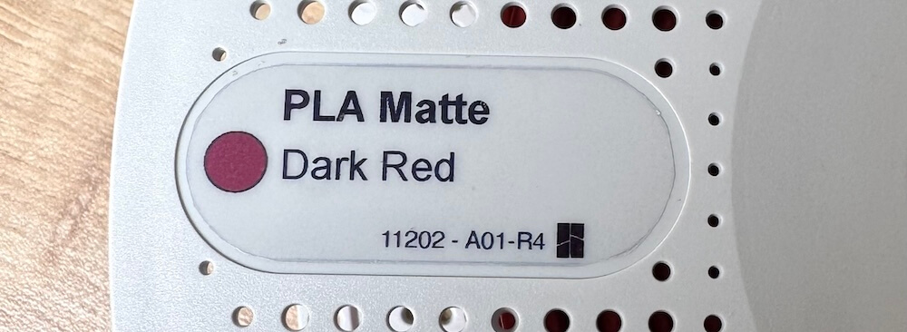

# Filament Spool Label Generator

Bambu Lab offers a huge range of filaments, and many colors are very close to each other — there are countless shades of gray, blue, and other colors that are nearly impossible to tell apart by eye. The default spool label only shows the material, which isn't helpful when you're staring at a wall of spools trying to find the right one.

This tool generates printable labels (44mm × 18mm) that show both the **material**, the **color name**, and a **color swatch** for each filament, so you can identify your spools at a glance.

**[Open the app](https://bemble.github.io/filament-spool-label-generator/)**



## Usage

1. Select a **filament maker**
2. Pick a **template** (built-in or your own)
3. Choose a **material** (or "All materials") and click **Generate Labels**
4. Hit **Print**

## Local development

```sh
python3 -m http.server -d src/ 8080
```

Then open [http://localhost:8080](http://localhost:8080).

## Custom templates

Templates are SVG files. Select "Upload your template..." in the template selector, then drag and drop an SVG file onto the upload area or use the file picker.

Your file is never uploaded — everything stays in your browser.

### Field mapping

Add `data-label="<value>"` to any SVG element to have it filled in automatically. Elements without a `data-label` are left untouched.

| `data-label` value | Injected content | Notes |
|---|---|---|
| `material` | Material name | Brackets and parentheses are stripped, e.g. `PLA Basic (Legacy)` → `PLA Basic` |
| `color` or `color_badge` | Color swatch fill | The `fill` CSS property is set to the filament's hex color |
| `color_name` | Color name | e.g. `Maroon Red` |
| `color_code___id` | Code and ID | Formatted as `code - id`, e.g. `10205 - A00-R2`. If a `<tspan>` child is present, it is updated instead |

The SVG `width` and `height` attributes set the print size (e.g. `width="44mm" height="18mm"`).

### Adding a filament maker or template

Filament makers and templates are declared in `src/list.json`:

```json
[
  {
    "id": "my-brand",
    "name": "My Brand",
    "dataUrl": "https://example.com/filaments.json",
    "credits": {
      "label": "author",
      "url": "https://github.com/author/repo"
    },
    "templates": [
      { "id": "default", "name": "Default", "url": "./templates/label-my-brand-default.svg" }
    ]
  }
]
```

The filament JSON at `dataUrl` must be an array of objects with at least these fields: `material`, `color_name`, `color_hex`, `code`, `id`.

## Credits

Filament database by [piitaya](https://github.com/piitaya/bambu-spoolman-db) — thanks!
